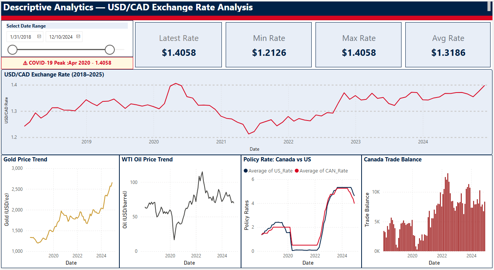
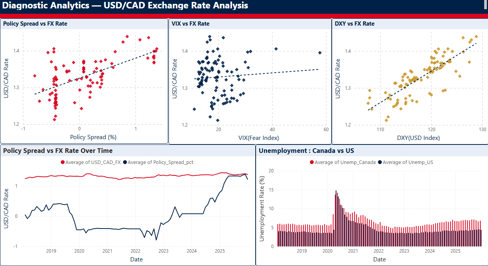
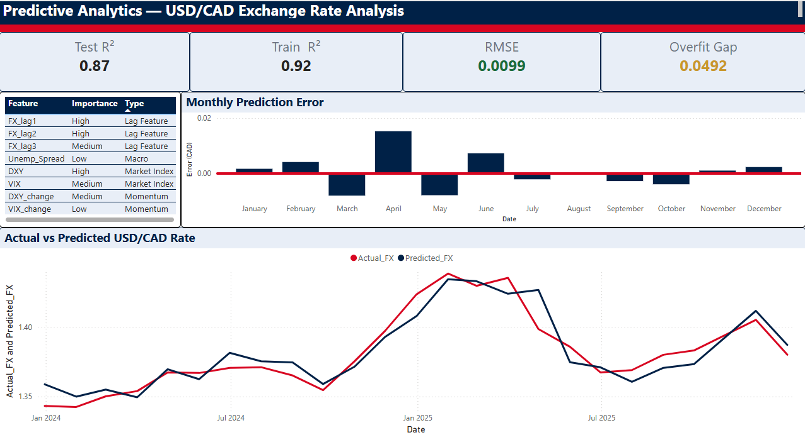

# USD/CAD Exchange Rate Analytics

An end-to-end analytics project exploring the USD/CAD exchange rate through **descriptive, diagnostic, and predictive analytics**.

## Project Overview

This project analyzes historical USD/CAD exchange-rate movements using economic and market data collected from multiple public sources.

I independently collected, cleaned, transformed, and integrated data from **14 sources** to create a custom analytical dataset covering **2018–2025**. The project combines data analysis, feature engineering, machine learning, and interactive Power BI reporting.

## Dashboard Preview

### Descriptive Analytics

Historical USD/CAD trends and key economic indicators.

### Diagnostic Analytics

Exploration of relationships between USD/CAD and selected economic and market factors.

### Predictive Analytics

Model performance, actual vs. predicted exchange rates, prediction errors, and key model features.

## Tools & Technologies

- **Python:** Pandas, Scikit-learn
- **Microsoft Excel:** Data cleaning, transformation, and integration
- **Power BI:** Data modeling, DAX, KPI reporting, and interactive dashboards
- **Machine Learning:** Linear Regression

## Project Highlights

- Collected and integrated data from **14 public economic and market sources**
- Built a custom analytical dataset covering **2018–2025**
- Performed descriptive, diagnostic, and predictive analysis
- Engineered lag, spread, volatility, and momentum features
- Improved test **R² from -4.80 to 0.8714** through iterative model refinement
- Achieved an **RMSE of 0.0099 (0.99¢)**
- Developed a **3-page interactive Power BI dashboard**

## Data Availability

The complete dataset and detailed data-preparation files are not publicly included in this repository.

**Data may be made available upon request for review or educational purposes.**

## Note

This project was developed for academic learning and portfolio demonstration.
